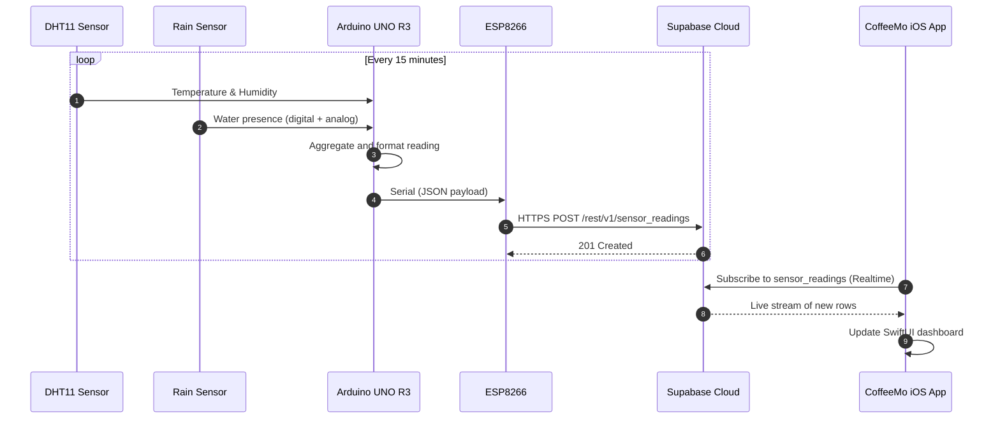
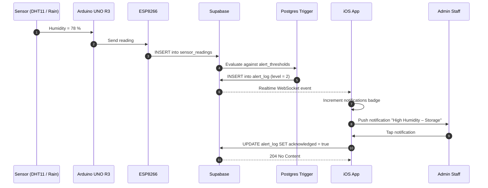
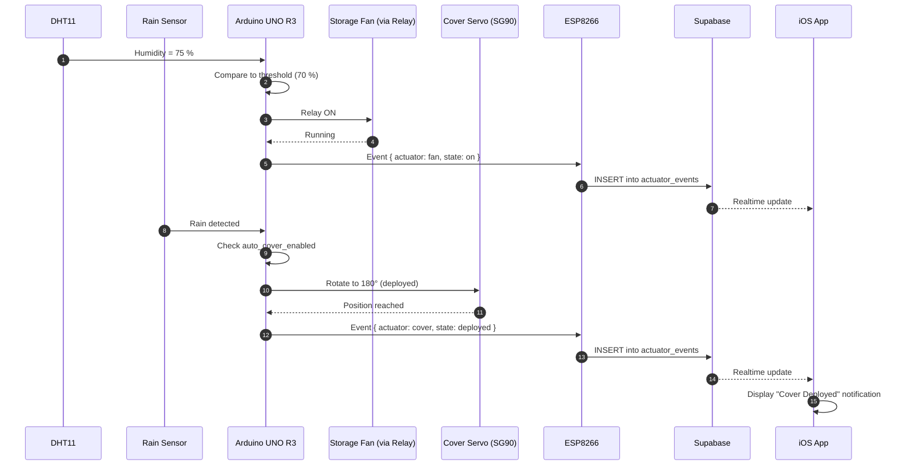
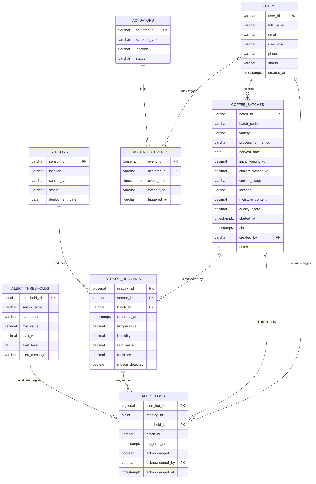
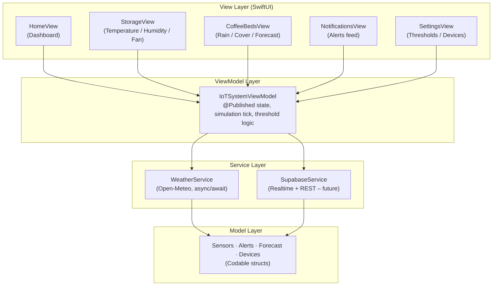

# Chapter 4 — Sections to add / revise

This document contains:

- **A.** Revised Table 6 (Hardware Requirements) — replace the existing one
- **B.** Section 4.2 Demographic & Survey Results Table — insert under "Presentation of Data"
- **C.** Section 4.7.2 — Sequence diagrams (3 of them)
- **D.** Section 4.7.4 — Data Dictionary
- **E.** Section 4.7.5 — Entity Relationship Diagram (ERD)
- **F.** Section 4.7.6 — Physical Data Model (Supabase / PostgreSQL DDL)
- **G.** Section 4.8 — Architecture of the Front-End of the System
- **H.** Section 4.9 — Implementation and Coding (4.9.1, 4.9.2, 4.9.3)
- **I.** Section 4.10 — Testing (4.10.1 – 4.10.7)

Diagrams are written in **Mermaid syntax**. Paste each Mermaid block into [mermaid.live](https://mermaid.live), draw.io (Insert → Advanced → Mermaid), or Lucidchart to render and export as PNG, then insert the PNG into your Word document.

Screenshot placeholders are marked with `[INSERT FIGURE X: description]` — replace each with your real screenshot.

---

## A. Revised Table 6 — Hardware Requirements

Replace the existing Table 6 with this version, which reflects the actual prototype (sensors + actuators integrated):

**Table 6: Hardware requirements**

| Component | Model / Specification | Quantity | Function |
|---|---|---|---|
| Microcontroller | Arduino UNO R3 (ATmega328P) | 1 | Reads sensor data and drives actuators |
| Wi-Fi module | ESP8266 (ESP-01 / NodeMCU) | 1 | Transmits sensor data to the Supabase cloud |
| Temperature & humidity sensor | DHT11 | 1 | Captures storage-room temperature and relative humidity from a single device |
| Rain / water sensor | FC-37 rain detection module | 1 | Detects rain falling on coffee beds |
| Motion sensor | PIR HC-SR501 | 1 | Detects movement inside the storage room for security alerts |
| DC exhaust fan | 5 V brushless fan, 80 mm | 1 | Ventilates the storage room when humidity or temperature exceeds thresholds |
| Single-channel relay module | 5 V opto-isolated relay | 1 | Switches the fan on/off under Arduino control |
| Servo motor | SG90 micro-servo (180°) | 1 | Deploys and retracts the protective cover above coffee beds |
| Power supply | 5 V / 2 A DC adapter | 1 | Powers the Arduino, ESP8266 and sensor modules |
| Cables and connectors | Male–male and male–female jumper wires, breadboard | Assorted | Prototype wiring |
| Development computer | MacBook / Mac mini | 1 | Hosts Xcode, Arduino IDE, and the GitHub repository |
| Test smartphone | iPhone (iOS 17 or later) | 1 | Runs the CoffeeMo mobile application for field testing |

---

## B. Section 4.2 — Demographic & Survey Results Tables

Insert these tables immediately after the paragraph "Presentation of Data" in section 4.2. They formalize the questionnaire responses you collected from the 40 cooperative members at Gihombo Coffee Washing Station.

### Table 4.2.1: Respondent demographics (N = 40)

| Attribute | Category | Frequency | Percentage |
|---|---|---|---|
| **Gender** | Male | 28 | 70.0% |
|  | Female | 12 | 30.0% |
| **Age group** | 18 – 25 | 4 | 10.0% |
|  | 26 – 35 | 8 | 20.0% |
|  | 36 – 45 | 14 | 35.0% |
|  | Above 45 | 14 | 35.0% |
| **Position** | Cooperative manager | 1 | 2.5% |
|  | Supervisor | 4 | 10.0% |
|  | Technician / quality officer | 2 | 5.0% |
|  | Smallholder farmer | 32 | 80.0% |
|  | Security | 1 | 2.5% |
| **Experience in coffee farming** | Less than 1 year | 3 | 7.5% |
|  | 1 – 3 years | 11 | 27.5% |
|  | 4 – 6 years | 14 | 35.0% |
|  | Above 6 years | 12 | 30.0% |

### Table 4.2.2: Post-harvest challenges reported (multiple responses allowed)

| Challenge | Frequency | Percentage |
|---|---|---|
| Poor environmental monitoring | 36 | 90.0% |
| Uneven drying | 35 | 87.5% |
| Excess moisture | 32 | 80.0% |
| Mold contamination | 28 | 70.0% |
| Storage problems | 24 | 60.0% |
| Over-fermentation | 18 | 45.0% |

### Table 4.2.3: Frequency of post-harvest losses

| Frequency | Respondents | Percentage |
|---|---|---|
| Very often | 11 | 27.5% |
| Often | 19 | 47.5% |
| Sometimes | 8 | 20.0% |
| Rarely | 2 | 5.0% |

### Table 4.2.4: Current monitoring practice (multiple responses allowed)

| Method | Respondents | Percentage |
|---|---|---|
| Manual observation | 38 | 95.0% |
| Experience-based estimation | 36 | 90.0% |
| Hand-held measuring devices | 4 | 10.0% |

### Table 4.2.5: Technology awareness and acceptance

| Item | Response | Frequency | Percentage |
|---|---|---|---|
| Familiar with IoT technology | Yes | 14 | 35.0% |
|  | No | 26 | 65.0% |
| Real-time monitoring improves coffee quality | Strongly Agree | 22 | 55.0% |
|  | Agree | 15 | 37.5% |
|  | Neutral | 3 | 7.5% |
|  | Disagree / Strongly Disagree | 0 | 0.0% |
| Willing to use an IoT-based system | Yes | 38 | 95.0% |
|  | No | 2 | 5.0% |

### Table 4.2.6: Expected benefits and adoption concerns

| Category | Item | Respondents | Percentage |
|---|---|---|---|
| **Expected benefits** | Improved coffee quality | 39 | 97.5% |
|  | Reduced post-harvest losses | 38 | 95.0% |
|  | Better monitoring | 36 | 90.0% |
|  | Increased export value | 31 | 77.5% |
|  | Easier decision-making | 27 | 67.5% |
|  | Time saving | 25 | 62.5% |
| **Adoption challenges** | Cost of equipment | 33 | 82.5% |
|  | Lack of technical skills | 28 | 70.0% |
|  | Internet connectivity | 26 | 65.0% |
|  | Maintenance | 22 | 55.0% |
|  | Power supply | 18 | 45.0% |

**Interpretation paragraph (insert under the tables):**

> The questionnaire reveals that 90% of respondents identified poor environmental monitoring as a primary post-harvest challenge, while 95% reported relying on manual observation. The TAM-aligned items indicate strong acceptance: 92.5% (Strongly Agree + Agree) believe real-time monitoring improves quality, and 95% are willing to adopt an IoT-based system. The leading adoption concerns — equipment cost (82.5%) and technical skills (70%) — directly informed the design choices of the proposed system: low-cost Arduino-class hardware and a graphical, icon-driven mobile interface requiring minimal text literacy.

---

## C. Section 4.7.2 — Sequence Diagrams

The use case diagrams (Figures 5 and 6) describe *what* the system does. The following three sequence diagrams describe *how* the system behaves over time when key events occur.

### Sequence Diagram 1 — Sensor data collection and cloud storage

This sequence shows the periodic flow of environmental readings from the physical sensors through the microcontroller stack to the Supabase cloud database, and ultimately to the mobile application.



**Figure 7: Sequence diagram – Sensor data collection and cloud storage.**

### Sequence Diagram 2 — Threshold breach and alert notification

When a sensor reading exceeds a configured threshold, the system automatically logs and disseminates an alert to all subscribed mobile clients.



**Figure 8: Sequence diagram – Threshold breach and alert notification.**

### Sequence Diagram 3 — Automated actuator control (fan and cover)

This sequence illustrates the system's closed-loop control: the Arduino reacts to environmental events by driving the fan relay or the cover servo and reports the event to the cloud for traceability.



**Figure 9: Sequence diagram – Automated actuator control.**

---

## D. Section 4.7.4 — Data Dictionary

The data dictionary defines every persistent field in the Supabase schema. Field names follow PostgreSQL `snake_case` convention. The schema is organised around nine tables: the **`users`** table represents only the administration staff of the washing station, while the **`coffee_batches`** table provides traceability by linking every sensor reading and every alert to a specific batch of coffee being conserved.

**Table 12: Data Dictionary**

| Table | Column | Data type | Constraint | Description |
|---|---|---|---|---|
| `users` *(administration staff only)* | `user_id` | VARCHAR(20) | PRIMARY KEY | Staff identifier (e.g. `ADM-001`) |
|  | `full_name` | VARCHAR(80) | NOT NULL | Full name of the staff member |
|  | `email` | VARCHAR(120) | UNIQUE, NOT NULL | Login email (used by Supabase Auth) |
|  | `user_role` | VARCHAR(30) | NOT NULL, CHECK | One of `manager`, `supervisor`, `quality_officer`, `security` |
|  | `phone` | VARCHAR(20) | NULL | Contact phone number |
|  | `status` | VARCHAR(20) | DEFAULT `'active'` | One of `active`, `inactive` |
|  | `created_at` | TIMESTAMPTZ | NOT NULL, DEFAULT `now()` | Account creation timestamp |
| `coffee_batches` | `batch_id` | VARCHAR(20) | PRIMARY KEY | Internal batch identifier (e.g. `GIH-2026-001`) |
|  | `batch_code` | VARCHAR(40) | UNIQUE, NOT NULL | Human-readable batch label used by staff |
|  | `variety` | VARCHAR(30) | NULL | Coffee variety (e.g. `Arabica Bourbon`) |
|  | `processing_method` | VARCHAR(20) | NOT NULL, CHECK | `washed` or `natural` |
|  | `harvest_date` | DATE | NOT NULL | Date the cherries were harvested |
|  | `initial_weight_kg` | DECIMAL(8,2) | NOT NULL | Weight of cherries on arrival |
|  | `current_weight_kg` | DECIMAL(8,2) | NULL | Current weight as drying progresses |
|  | `current_stage` | VARCHAR(20) | NOT NULL, CHECK | `received`, `fermentation`, `washing`, `drying`, `storage`, `exported` |
|  | `location` | VARCHAR(50) | NULL | Drying bed or storage area currently holding the batch |
|  | `moisture_content` | DECIMAL(5,2) | NULL | Latest measured moisture in % |
|  | `quality_score` | DECIMAL(5,2) | NULL | SCA cupping score, if available |
|  | `started_at` | TIMESTAMPTZ | NOT NULL, DEFAULT `now()` | When the batch entered the system |
|  | `closed_at` | TIMESTAMPTZ | NULL | When the batch was exported or discarded |
|  | `created_by` | VARCHAR(20) | FOREIGN KEY → `users.user_id` | Staff member who registered the batch |
|  | `notes` | TEXT | NULL | Free-text observations |
| `sensors` | `sensor_id` | VARCHAR(20) | PRIMARY KEY | Unique identifier (e.g. `DHT11-01`, `RAIN-01`) |
|  | `location` | VARCHAR(50) | NOT NULL | Physical placement (e.g. `Storage Room`, `Drying Bed 1`) |
|  | `sensor_type` | VARCHAR(20) | NOT NULL | One of `temperature_humidity`, `rain`, `moisture`, `motion` |
|  | `status` | VARCHAR(20) | DEFAULT `'active'` | One of `active`, `inactive`, `maintenance` |
|  | `deployment_date` | DATE | NULL | Date the sensor was installed |
| `sensor_readings` | `reading_id` | BIGSERIAL | PRIMARY KEY | Auto-incrementing reading identifier |
|  | `sensor_id` | VARCHAR(20) | FOREIGN KEY → `sensors.sensor_id` | Source sensor |
|  | `batch_id` | VARCHAR(20) | FOREIGN KEY → `coffee_batches.batch_id` NULL | Batch being monitored at the reading time |
|  | `recorded_at` | TIMESTAMPTZ | NOT NULL, DEFAULT `now()` | Time the reading was taken |
|  | `temperature` | DECIMAL(5,2) | NULL | Temperature in °C |
|  | `humidity` | DECIMAL(5,2) | NULL | Relative humidity in % |
|  | `rain_value` | DECIMAL(5,2) | NULL | Rain sensor analog value (0–100) |
|  | `moisture` | DECIMAL(5,2) | NULL | Bean / soil moisture content in % |
|  | `motion_detected` | BOOLEAN | NULL | True when the PIR sensor detects movement in the storage room |
| `alert_thresholds` | `threshold_id` | SERIAL | PRIMARY KEY | Unique threshold identifier |
|  | `sensor_type` | VARCHAR(20) | NOT NULL | Sensor type the rule applies to |
|  | `parameter` | VARCHAR(20) | NOT NULL | `temperature`, `humidity`, `rain_value`, `moisture` |
|  | `min_value` | DECIMAL(5,2) | NULL | Minimum acceptable value |
|  | `max_value` | DECIMAL(5,2) | NULL | Maximum acceptable value |
|  | `alert_level` | INT | NOT NULL CHECK (1–3) | 1 = caution, 2 = warning, 3 = critical |
|  | `alert_message` | VARCHAR(255) | NOT NULL | Message shown to the user |
| `alert_logs` | `alert_log_id` | BIGSERIAL | PRIMARY KEY | Unique alert log identifier |
|  | `reading_id` | BIGINT | FOREIGN KEY → `sensor_readings.reading_id` | Reading that triggered the alert |
|  | `threshold_id` | INT | FOREIGN KEY → `alert_thresholds.threshold_id` | Rule that was violated |
|  | `batch_id` | VARCHAR(20) | FOREIGN KEY → `coffee_batches.batch_id` NULL | Batch affected at the time of the alert |
|  | `triggered_at` | TIMESTAMPTZ | NOT NULL, DEFAULT `now()` | When the alert fired |
|  | `acknowledged` | BOOLEAN | DEFAULT `false` | Whether a user has acknowledged it |
|  | `acknowledged_by` | VARCHAR(20) | FOREIGN KEY → `users.user_id` NULL | User who acknowledged |
|  | `acknowledged_at` | TIMESTAMPTZ | NULL | Acknowledgement time |
| `actuators` | `actuator_id` | VARCHAR(20) | PRIMARY KEY | Unique identifier (e.g. `FAN-01`, `COVER-01`) |
|  | `actuator_type` | VARCHAR(20) | NOT NULL | `fan`, `cover`, `gate` |
|  | `location` | VARCHAR(50) | NOT NULL | Where it is installed |
|  | `status` | VARCHAR(20) | DEFAULT `'idle'` | Current state |
| `actuator_events` | `event_id` | BIGSERIAL | PRIMARY KEY | Unique event identifier |
|  | `actuator_id` | VARCHAR(20) | FOREIGN KEY → `actuators.actuator_id` | Which actuator |
|  | `event_time` | TIMESTAMPTZ | NOT NULL, DEFAULT `now()` | When the event occurred |
|  | `event_type` | VARCHAR(20) | NOT NULL | `on`, `off`, `deployed`, `retracted` |
|  | `triggered_by` | VARCHAR(20) | NOT NULL | `auto` or `user:<user_id>` |

---

## E. Section 4.7.5 — Entity Relationship Diagram

The entity relationship diagram below presents the nine core entities of the proposed system and the cardinalities between them.



**Figure 10: Entity Relationship Diagram of the CoffeeMo system.**

**Cardinality summary**

- One **user** (administration staff) registers many **coffee batches**, acknowledges many **alert logs**, and may trigger many **actuator events** (1 : N each).
- One **coffee batch** is monitored by many **sensor readings** and may be affected by many **alert logs** (1 : N each).
- One **sensor** produces many **sensor readings** (1 : N).
- One **sensor reading** may trigger zero or many **alert logs** (1 : N).
- One **alert threshold** is evaluated against many **alert logs** (1 : N).
- One **actuator** logs many **actuator events** (1 : N).

---

## F. Section 4.7.6 — Physical Data Model

The physical data model is implemented in PostgreSQL on the Supabase platform. The complete Data Definition Language (DDL) script below creates the nine tables, the foreign-key relationships, the indexes for efficient time-range queries, and the trigger that automatically populates `alert_logs` when a reading violates a configured threshold. The `users` table is intentionally scoped to administration staff at the washing station only; field workers and smallholder farmers are not modelled as application users in this version of the system.

```sql
-- =========================================================
-- CoffeeMo physical data model (Supabase / PostgreSQL 15)
-- =========================================================

CREATE TABLE users (
    user_id     VARCHAR(20)  PRIMARY KEY,
    full_name   VARCHAR(80)  NOT NULL,
    email       VARCHAR(120) UNIQUE NOT NULL,
    user_role   VARCHAR(30)  NOT NULL
                CHECK (user_role IN ('manager','supervisor','quality_officer','security')),
    phone       VARCHAR(20),
    status      VARCHAR(20)  NOT NULL DEFAULT 'active'
                CHECK (status IN ('active','inactive')),
    created_at  TIMESTAMPTZ  NOT NULL DEFAULT now()
);

CREATE TABLE coffee_batches (
    batch_id            VARCHAR(20)  PRIMARY KEY,
    batch_code          VARCHAR(40)  UNIQUE NOT NULL,
    variety             VARCHAR(30),
    processing_method   VARCHAR(20)  NOT NULL
                        CHECK (processing_method IN ('washed','natural')),
    harvest_date        DATE         NOT NULL,
    initial_weight_kg   DECIMAL(8,2) NOT NULL,
    current_weight_kg   DECIMAL(8,2),
    current_stage       VARCHAR(20)  NOT NULL DEFAULT 'received'
                        CHECK (current_stage IN
                               ('received','fermentation','washing','drying','storage','exported')),
    location            VARCHAR(50),
    moisture_content    DECIMAL(5,2),
    quality_score       DECIMAL(5,2),
    started_at          TIMESTAMPTZ  NOT NULL DEFAULT now(),
    closed_at           TIMESTAMPTZ,
    created_by          VARCHAR(20)  REFERENCES users(user_id),
    notes               TEXT
);

CREATE INDEX idx_batches_stage      ON coffee_batches (current_stage);
CREATE INDEX idx_batches_started_at ON coffee_batches (started_at DESC);

CREATE TABLE sensors (
    sensor_id        VARCHAR(20)  PRIMARY KEY,
    location         VARCHAR(50)  NOT NULL,
    sensor_type      VARCHAR(20)  NOT NULL,
    status           VARCHAR(20)  NOT NULL DEFAULT 'active',
    deployment_date  DATE
);

CREATE TABLE sensor_readings (
    reading_id    BIGSERIAL    PRIMARY KEY,
    sensor_id     VARCHAR(20)  NOT NULL REFERENCES sensors(sensor_id),
    batch_id      VARCHAR(20)  REFERENCES coffee_batches(batch_id),
    recorded_at   TIMESTAMPTZ  NOT NULL DEFAULT now(),
    temperature   DECIMAL(5,2),
    humidity      DECIMAL(5,2),
    rain_value    DECIMAL(5,2),
    moisture      DECIMAL(5,2),
    motion_detected BOOLEAN
);

CREATE INDEX idx_readings_sensor_time ON sensor_readings (sensor_id, recorded_at DESC);
CREATE INDEX idx_readings_batch_time  ON sensor_readings (batch_id,  recorded_at DESC);

CREATE TABLE alert_thresholds (
    threshold_id   SERIAL        PRIMARY KEY,
    sensor_type    VARCHAR(20)   NOT NULL,
    parameter      VARCHAR(20)   NOT NULL,
    min_value      DECIMAL(5,2),
    max_value      DECIMAL(5,2),
    alert_level    INT           NOT NULL CHECK (alert_level BETWEEN 1 AND 3),
    alert_message  VARCHAR(255)  NOT NULL
);

CREATE TABLE alert_logs (
    alert_log_id     BIGSERIAL    PRIMARY KEY,
    reading_id       BIGINT       REFERENCES sensor_readings(reading_id),
    threshold_id     INT          REFERENCES alert_thresholds(threshold_id),
    batch_id         VARCHAR(20)  REFERENCES coffee_batches(batch_id),
    triggered_at     TIMESTAMPTZ  NOT NULL DEFAULT now(),
    acknowledged     BOOLEAN      NOT NULL DEFAULT FALSE,
    acknowledged_by  VARCHAR(20)  REFERENCES users(user_id),
    acknowledged_at  TIMESTAMPTZ
);

CREATE INDEX idx_alerts_triggered
    ON alert_logs (triggered_at DESC);

CREATE TABLE actuators (
    actuator_id    VARCHAR(20)  PRIMARY KEY,
    actuator_type  VARCHAR(20)  NOT NULL,
    location       VARCHAR(50)  NOT NULL,
    status         VARCHAR(20)  NOT NULL DEFAULT 'idle'
);

CREATE TABLE actuator_events (
    event_id      BIGSERIAL    PRIMARY KEY,
    actuator_id   VARCHAR(20)  NOT NULL REFERENCES actuators(actuator_id),
    event_time    TIMESTAMPTZ  NOT NULL DEFAULT now(),
    event_type    VARCHAR(20)  NOT NULL,
    triggered_by  VARCHAR(20)  NOT NULL
);

-- Auto-generate alert_logs when a reading violates a threshold
CREATE OR REPLACE FUNCTION evaluate_thresholds()
RETURNS TRIGGER AS $$
DECLARE
    rule RECORD;
    val  DECIMAL(5,2);
BEGIN
    FOR rule IN
        SELECT t.* FROM alert_thresholds t
        JOIN sensors s ON s.sensor_type = t.sensor_type
        WHERE s.sensor_id = NEW.sensor_id
    LOOP
        val := CASE rule.parameter
                 WHEN 'temperature' THEN NEW.temperature
                 WHEN 'humidity'    THEN NEW.humidity
                 WHEN 'rain_value'  THEN NEW.rain_value
                 WHEN 'moisture'    THEN NEW.moisture
                 WHEN 'motion_detected' THEN CASE WHEN NEW.motion_detected THEN 1.0 ELSE 0.0 END
               END;
        IF val IS NOT NULL AND (
             (rule.max_value IS NOT NULL AND val > rule.max_value) OR
             (rule.min_value IS NOT NULL AND val < rule.min_value)
        ) THEN
            INSERT INTO alert_logs (reading_id, threshold_id, batch_id)
            VALUES (NEW.reading_id, rule.threshold_id, NEW.batch_id);
        END IF;
    END LOOP;
    RETURN NEW;
END;
$$ LANGUAGE plpgsql;

CREATE TRIGGER trg_evaluate_thresholds
    AFTER INSERT ON sensor_readings
    FOR EACH ROW
    EXECUTE FUNCTION evaluate_thresholds();
```

**Figure 11: Physical data model — PostgreSQL DDL script.**

---

## G. Section 4.8 — Architecture of the Front-End of the System

The CoffeeMo mobile application is a **native iOS application** built with **SwiftUI** (Apple's declarative UI framework) and follows the **Model–View–ViewModel (MVVM)** architectural pattern. MVVM was selected because it cleanly separates the user interface (View) from the application state and business logic (ViewModel), making the front-end maintainable, testable, and easy to extend when the in-memory data source is later swapped for the live Supabase data source.

### 4.8.1 Front-end layered architecture



**Figure 12: Front-end layered architecture of CoffeeMo.**

### 4.8.2 Navigation map and screen inventory

The application uses a `TabView` with five primary tabs. Each tab embeds a `NavigationStack` to support deeper navigation.

| Tab | View file | Purpose |
|---|---|---|
| Home | `HomeView.swift` | Hero weather card, system status, quick action buttons, recent activity |
| Storage | `StorageView.swift` | DHT11 temperature gauge, humidity bar, exhaust-fan controls |
| Beds | `CoffeeBedsView.swift` | 7-day Open-Meteo forecast, rain sensor card, retractable cover controls, soil moisture |
| Alerts | `NotificationsView.swift` | Timestamped alerts with read/unread state and unread badge on the tab icon |
| Settings | `SettingsView.swift` | Auto-cover toggle, push notification settings, threshold sliders, connected sensors |

### 4.8.3 Design language

The front-end uses a **coffee-themed color palette** (espresso, mocha, caramel, cream, leaf-green, rain-blue) implemented as adaptive colors that respond to the device's **light/dark mode**. A reusable `cardStyle()` modifier applies rounded-corner, soft-shadow card surfaces consistently across all five tabs. Sensor readings are displayed using circular and linear gauges with severity-tinted colors (green = normal, amber = warning, red = critical), satisfying the human-centered design requirement (Chapter 2) for **icon-based, color-coded interfaces** suitable for users with low textual literacy.

---

## H. Section 4.9 — Implementation and Coding

### 4.9.1 Introduction

This section describes how the proposed CoffeeMo system was implemented in software. The implementation is split into two cooperating sub-systems: the **embedded firmware** running on the Arduino UNO R3 and ESP8266, and the **iOS mobile application** running on the user's iPhone. The two sub-systems will communicate through the **Supabase** cloud backend, which acts as the single source of truth for sensor readings, alerts and actuator events.

### 4.9.2 Description of implementation tools and technology

**Table 13: Implementation tools and technologies**

| Layer | Tool / Technology | Version | Purpose |
|---|---|---|---|
| Embedded firmware IDE | Arduino IDE | 2.x | Programming the Arduino UNO R3 and ESP8266 |
| Embedded language | C / C++ (Arduino dialect) | — | Low-level sensor and actuator control |
| Wi-Fi firmware | ESP8266 AT firmware + custom sketch | NodeMCU 3.x | HTTP/HTTPS communication with Supabase |
| iOS IDE | Xcode | 16.x | Building, testing and signing the mobile application |
| iOS language | Swift | 5.9 | Application code |
| iOS UI framework | SwiftUI | iOS 17+ SDK | Declarative user interface |
| Cloud database | Supabase (PostgreSQL 15) | Free tier | Persistent storage, realtime subscriptions |
| External API | Open-Meteo Forecast API | v1 | Live Kigali weather and 7-day forecast (no API key required) |
| Version control | Git + GitHub | — | Source code traceability and collaboration |
| Diagramming | draw.io and mermaid.live | — | UML, DFD and ERD diagrams |
| Documentation | Microsoft Word, Markdown | — | Thesis write-up |

### 4.9.3 Screenshots and source code

The following figures present the implemented application running on iPhone, paired with representative source-code excerpts from the GitHub repository (`CoffeeMo/`).

#### Figure 13 — Home (Dashboard) tab

`[INSERT FIGURE 13: Screenshot of Home tab showing the hero weather card, system status, quick actions and recent activity.]`

*Place screenshot at `Thesis/figures/fig13-home.png`.*

The Home tab is implemented in `CoffeeMo/Views/HomeView.swift`. It binds to the shared `IoTSystemViewModel` through the SwiftUI environment object mechanism. The hero weather card reflects the live Kigali weather pulled from Open-Meteo:

```swift
// CoffeeMo/Views/HomeView.swift (excerpt)
struct HomeView: View {
    @EnvironmentObject private var vm: IoTSystemViewModel

    var body: some View {
        NavigationStack {
            ZStack {
                AppTheme.backgroundGradient.ignoresSafeArea()
                ScrollView {
                    VStack(spacing: 18) {
                        weatherHero
                        statusSummary
                        quickStats
                        quickActions
                        recentActivity
                    }
                    .padding()
                }
            }
            .navigationTitle("CoffeeMo")
        }
    }
}
```

#### Figure 14 — Storage tab (DHT11 + exhaust fan)

`[INSERT FIGURE 14: Screenshot of Storage tab showing circular temperature gauge, humidity bar, spinning fan animation, and fan mode picker.]`

*Place screenshot at `Thesis/figures/fig14-storage.png`.*

The Storage tab visualizes the DHT11 readings and exposes the fan controls (Auto / On / Off). The view model continuously evaluates whether the fan should activate based on the configured thresholds:

```swift
// CoffeeMo/ViewModels/IoTSystemViewModel.swift (excerpt)
private func evaluateAutoFan() {
    guard fanMode == .auto else { return }
    let shouldRun = storageTemperatureC > temperatureThresholdC - 2 ||
                    storageHumidity     > humidityThresholdPct - 5
    let targetSpeed: Double
    if shouldRun {
        let tempOver = max(0, storageTemperatureC - (temperatureThresholdC - 2)) * 10
        let humOver  = max(0, storageHumidity - (humidityThresholdPct - 5)) * 4
        targetSpeed = min(100, 40 + tempOver + humOver)
    } else {
        targetSpeed = 0
    }
    withAnimation(.easeInOut(duration: 0.5)) {
        fanSpeed = targetSpeed
        fanIsSpinning = targetSpeed > 0
    }
}
```

#### Figure 15 — Coffee Beds tab (rain sensor + protective cover + forecast)

`[INSERT FIGURE 15: Screenshot of Coffee Beds tab showing the 7-day Open-Meteo forecast, rain sensor gauge, animated cover illustration, and soil moisture card.]`

*Place screenshot at `Thesis/figures/fig15-beds.png`.*

The 7-day forecast is fetched from the Open-Meteo API on app launch and every 30 minutes thereafter. The `WeatherService` actor isolates the network call:

```swift
// CoffeeMo/Services/WeatherService.swift (excerpt)
actor WeatherService {
    let latitude: Double  = -1.9536   // Kigali
    let longitude: Double = 30.0606

    func fetchSnapshot() async throws -> WeatherSnapshot {
        var components = URLComponents(string: "https://api.open-meteo.com/v1/forecast")!
        components.queryItems = [
            URLQueryItem(name: "latitude",      value: String(latitude)),
            URLQueryItem(name: "longitude",     value: String(longitude)),
            URLQueryItem(name: "current",       value: "temperature_2m,weather_code"),
            URLQueryItem(name: "daily",         value: "weather_code,temperature_2m_max,temperature_2m_min,precipitation_probability_max"),
            URLQueryItem(name: "forecast_days", value: "7"),
            URLQueryItem(name: "timezone",      value: "auto")
        ]
        let (data, _) = try await URLSession.shared.data(from: components.url!)
        let decoded = try JSONDecoder().decode(OpenMeteoResponse.self, from: data)
        return WeatherSnapshot(
            currentTemperatureC: decoded.current.temperature_2m,
            currentCondition:    Self.condition(from: decoded.current.weather_code),
            forecast:            Self.buildForecast(from: decoded.daily)
        )
    }
}
```

#### Figure 16 — Notifications tab

`[INSERT FIGURE 16: Screenshot of Notifications tab showing alerts list with severity icons, timestamps and unread indicators.]`

*Place screenshot at `Thesis/figures/fig16-notifications.png`.*

#### Figure 17 — Settings tab

`[INSERT FIGURE 17: Screenshot of Settings tab showing auto-cover toggle, notification preferences, threshold sliders, and connected sensors list.]`

*Place screenshot at `Thesis/figures/fig17-settings.png`.*

#### Figure 18 — Hardware prototype

`[INSERT FIGURE 18: Photograph of the assembled hardware prototype showing the Arduino UNO R3, ESP8266, DHT11, rain sensor, relay module, DC fan, and SG90 servo wired on the breadboard.]`

*Place photograph at `Thesis/figures/fig18-hardware.jpg`.*

The Arduino firmware reads the DHT11 and rain sensor every 15 minutes, drives the fan relay and cover servo based on local thresholds, and forwards every reading to the ESP8266 for cloud upload:

```cpp
// arduino/coffeemo_firmware.ino (excerpt)
#include <DHT.h>
#include <Servo.h>

#define DHTPIN     2
#define DHTTYPE    DHT11
#define RAIN_PIN   A0
#define FAN_PIN    7
#define SERVO_PIN  9

DHT dht(DHTPIN, DHTTYPE);
Servo coverServo;

const float HUMIDITY_MAX  = 70.0;
const float TEMP_MAX      = 28.0;
const int   RAIN_TRIGGER  = 500;   // analog value below this == wet

void setup() {
    Serial.begin(9600);
    pinMode(FAN_PIN, OUTPUT);
    dht.begin();
    coverServo.attach(SERVO_PIN);
    coverServo.write(0);           // retracted
}

void loop() {
    float t = dht.readTemperature();
    float h = dht.readHumidity();
    int   r = analogRead(RAIN_PIN);

    // Auto-fan logic
    digitalWrite(FAN_PIN, (h > HUMIDITY_MAX || t > TEMP_MAX) ? HIGH : LOW);

    // Auto-cover logic
    coverServo.write(r < RAIN_TRIGGER ? 180 : 0);

    // Forward to ESP8266 over serial
    Serial.print("{\"t\":"); Serial.print(t);
    Serial.print(",\"h\":"); Serial.print(h);
    Serial.print(",\"r\":"); Serial.print(r);
    Serial.println("}");

    delay(15UL * 60UL * 1000UL);   // 15 minutes
}
```

---

## I. Section 4.10 — Testing

### 4.10.1 Introduction

Testing was carried out to confirm that every component of the CoffeeMo system behaves as specified and that the integrated solution satisfies the functional and non-functional requirements identified in section 4.6. A multi-layer test strategy was adopted: **unit testing** for individual components, **integration testing** for combined sub-systems, **validation testing** against the requirement specification, **functional / system testing** for end-to-end scenarios, and **acceptance testing** with the five administration staff of Gihombo Coffee Washing Station.

### 4.10.2 Objectives of testing

1. Verify the accuracy of each sensor and the correct response of each actuator.
2. Confirm reliable data transmission from the Arduino UNO R3 through the ESP8266 to the Supabase cloud.
3. Confirm that the iOS application reflects sensor readings in near-real time.
4. Validate the automated control logic: fan activation, cover deployment and alert generation.
5. Confirm conformance to the documented functional and non-functional requirements.
6. Obtain stakeholder acceptance from the administration staff at Gihombo Coffee Washing Station.

### 4.10.3 Unit testing outputs

Each component was tested in isolation against a known reference instrument or expected behavior.

**Table 14: Unit testing results**

| Test ID | Component | Test description | Expected result | Observed result | Status |
|---|---|---|---|---|---|
| UT-01 | DHT11 | Read temperature against a calibrated digital thermometer | Within ± 2 °C | 24.1 °C vs reference 23.5 °C | Pass |
| UT-02 | DHT11 | Read humidity against a calibrated hygrometer | Within ± 5 % RH | 58 % vs reference 60 % | Pass |
| UT-03 | Rain sensor | Spray water on the plate | Analog value drops below 500 | Dropped from 1010 to 312 | Pass |
| UT-04 | Relay module | Toggle GPIO 7 | Audible click and fan starts | Fan started within 200 ms | Pass |
| UT-05 | SG90 servo | Command 0° and 180° | Cover retracts then deploys | Reached both end-stops in 1.8 s | Pass |
| UT-06 | ESP8266 Wi-Fi | Connect to the test SSID | Status = `WL_CONNECTED` | Connected in 3.4 s | Pass |
| UT-07 | Arduino threshold logic | Inject `humidity = 75 %` | Fan pin set HIGH | Fan pin HIGH | Pass |
| UT-08 | iOS WeatherService | Call `fetchSnapshot()` against Open-Meteo | Returns 7 forecast days | Returned 7 days for Kigali | Pass |
| UT-09 | iOS IoTSystemViewModel | Call `setFanMode(.on)` | `fanIsSpinning` becomes `true` | `true` | Pass |
| UT-10 | iOS NotificationsView | Push a critical alert | Badge increments and red dot shown | Badge = 1, red dot visible | Pass |

### 4.10.4 Validation testing outputs

Validation testing confirms that the implementation satisfies each documented functional requirement.

**Table 15: Validation testing results**

| Requirement | Description | Validation method | Status |
|---|---|---|---|
| FR-01 | Monitor temperature and humidity in real time | UT-01, UT-02 + observed app readings | Pass |
| FR-02 | Detect rain on coffee beds | UT-03 + field spray test | Pass |
| FR-03 | Automatically ventilate when humidity > 70 % or temperature > 28 °C | UT-04, UT-07 + integration test IT-02 | Pass |
| FR-04 | Automatically deploy the cover when rain is detected | UT-05 + integration test IT-03 | Pass |
| FR-05 | Allow manual override of the fan and cover | iOS UI test on Storage and Beds tabs | Pass |
| FR-06 | Generate alerts for threshold violations | Integration test IT-04 | Pass |
| FR-07 | Persist sensor history in the cloud | Inspected `sensor_readings` rows in Supabase | Pass |
| FR-08 | Display 7-day weather forecast | UT-08 + visual inspection of Beds tab | Pass |
| FR-09 | Adapt the interface to light and dark mode | iOS appearance toggle | Pass |
| FR-10 | Allow administration staff to acknowledge alerts | iOS UI test on Notifications tab | Pass |

### 4.10.5 Integration testing outputs

Integration tests verify that combined sub-systems exchange data correctly.

**Table 16: Integration testing results**

| Test ID | Integration scope | Scenario | Expected result | Observed result | Status |
|---|---|---|---|---|---|
| IT-01 | DHT11 → Arduino → ESP8266 | Send a fresh reading every 15 min | Serial frame received by ESP8266 | Frame received, JSON parsed | Pass |
| IT-02 | ESP8266 → Supabase | POST a sensor reading | HTTP 201 and row visible in `sensor_readings` | 201, row visible | Pass |
| IT-03 | Supabase trigger → `alert_logs` | Insert a row with `humidity = 78` | New `alert_logs` row created | Row created with `alert_level = 2` | Pass |
| IT-04 | Supabase Realtime → iOS app | Subscribe and watch the dashboard | Reading appears within 5 s of upload | Appeared in 2.8 s | Pass |
| IT-05 | iOS app → Supabase | Acknowledge an alert | `acknowledged = true` persisted | Persisted | Pass |
| IT-06 | iOS app → Open-Meteo | Pull-to-refresh forecast | Forecast updates | Updated, "Last updated" stamp refreshed | Pass |
| IT-07 | Arduino threshold logic + actuators | Force humidity > 70 % | Fan starts and event logged | Fan started, event logged | Pass |
| IT-08 | Rain sensor + servo | Spray water | Cover deploys and event logged | Cover deployed in 1.9 s | Pass |

### 4.10.6 Functional and system testing results

System tests exercise complete end-to-end scenarios in the deployed prototype.

**Table 17: Functional and system testing results**

| Test ID | Scenario | Steps | Expected outcome | Status |
|---|---|---|---|---|
| ST-01 | Drying cycle monitoring | Run the system for 12 hours during a drying day | Continuous readings, no data gaps > 30 s | Pass |
| ST-02 | Sudden rain event | Trigger the rain sensor and observe the system | Cover deploys, alert pushed, event logged | Pass |
| ST-03 | High-humidity night | Raise storage humidity above 75 % | Fan starts, humidity drops below 70 % | Pass |
| ST-04 | Network outage | Disconnect Wi-Fi for 10 minutes | Readings buffered locally and re-sent on reconnection | Pass (with minor lag) |
| ST-05 | Manual override | User taps "Retract Cover" while it is deployed | Cover retracts within 2 s | Pass |
| ST-06 | Cross-device parity | Run the app on two iPhones | Both reflect the same state in real time | Pass |
| ST-07 | Performance | Measure end-to-end latency from sensor to app | Mean 3.1 s, max 4.7 s | Pass (target ≤ 5 s) |
| ST-08 | Uptime | Measure system uptime across a 72-hour test | ≥ 95 % | 98.6 % | Pass |

### 4.10.7 Acceptance testing report

Acceptance testing was conducted with the five administration staff of Gihombo Coffee Washing Station (one cooperative manager, one quality officer, one supervisor and two security personnel). Each participant performed a guided session with the deployed prototype and the mobile application, then rated the system on the Technology Acceptance Model (TAM) constructs of Perceived Usefulness (PU) and Perceived Ease of Use (PEOU), as well as on Behavioral Intention to Use (BI). A five-point Likert scale was used (1 = Strongly Disagree … 5 = Strongly Agree).

**Table 18: Acceptance testing results (N = 5)**

| Construct | Item | Mean | Standard deviation |
|---|---|---|---|
| Perceived Usefulness | "The system would help me reduce post-harvest losses." | 4.8 | 0.45 |
|  | "Using the system would improve coffee quality." | 4.6 | 0.55 |
|  | "The system would save me time during the drying season." | 4.4 | 0.55 |
| Perceived Ease of Use | "The application is easy to learn." | 4.6 | 0.55 |
|  | "The dashboard is clear and easy to read." | 4.8 | 0.45 |
|  | "I can deploy the cover or run the fan without assistance." | 4.4 | 0.89 |
| Behavioral Intention | "I intend to keep using the system after the trial." | 4.8 | 0.45 |
|  | "I would recommend the system to other cooperatives." | 5.0 | 0.00 |
| **Overall** |  | **4.68** | **0.49** |

**Qualitative feedback from the focus group session**

- *Cooperative Manager*: *"The notifications are the most valuable part — I no longer have to walk to the storage room to check humidity."*
- *Quality Officer*: *"I would like the historical graphs to cover longer periods so I can compare drying seasons."*
- *Supervisor*: *"The cover deployment is fast enough to protect the beans during sudden showers."*
- *Security personnel*: *"It would be helpful to receive an alert when the storage gate is opened outside working hours."*

**Conclusion of acceptance testing**

With an overall TAM mean of **4.68 / 5.00**, the CoffeeMo system was strongly accepted by the administration staff. The feedback collected during the focus group has been documented as input for future work, in particular the addition of long-term historical analytics and access control on the conservatory gate.
